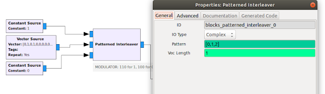

Ahh - fall is coming. The hot days of summer are coming to an end, and in just a few weeks we will be using our fireplaces again. At the request of my wife I checked both fireplaces and sure enough, one was not working. Actually, it was the remote that was not working.

## The Remote Control

The remote control is a Skytech 1040T. It has served us well for 10 years now but finally gave up the ghost. A fresh set of batteries brings the display back to life, but it still won't talk to our fireplace.

As it is a RF remote control this becomes a challenge for the HAM in me and I decide to spend my Sunday morning on looking deeper into it. A quick look at the sticker on the back revealed that it has an FCC ID, this makes things much easier. I can look up all information at fccid.io - and find its frequency range:

An FCC database search reveals that this remote should transmit on 303.87 Mhz. Short of professional test equipment here at home I get to break out my HackRF One and GQRX. I find the signal close to its frequency, at 302.00 Mhz. The oscillator must have shifted:

<figure align="center">
 
 <figcaption>
 GQRX before adjustment
 </figcaption>
</figure>

 

When I open the remote I see a variable capacitor. This looks promising. With the help of GQRX I adjust the VC so that we are back to a 303.87 Mhz center frequency.

<figure align="center">
 
 <figcaption>
 variable capacitor
 </figcaption>
</figure>

<figure align="center">
 
 <figcaption>
 GQRX after adjustment
 </figcaption>
</figure>

This fixes the issue. But since it is still early and I have my equipment already set up I want to see what else I can learn about the remote and the signal it sends.

## Hacking the protocol

I want to see what the signal looks like, and the best way to capture the signal is with GNU RadioCompanion. I set up an osmocom source, link it to my HackRF and then route it into an FFT Sink. I also remove the imaginary component and show the result in a scope view:

<figure align="center">
 
 </figure>

 So we have a signal. It looks pretty jagged and I suspect it's OOK - On/off keying, the simplest form of transmitting a signal, similar to ASK (Amplitude Shift Keying). It differs from ASK in that it only has a carrier signal and no additional information modulated onto it.
 In order to get a better look at the signal I add a threshold element and also pipe the result to a wav file sink for further analysis:

<figure align="center">
    
</figure>

This looks much cleaner and a pattern starts to emerge. It looks like I have two types of pulses, a short one and a long one. The scope plot is not really the right tool to analyze all the details, but since I sank the wav output into a file I can use Audacity to give it a closer look:

I recorded one push of the ON button and one push of the OFF button; these are the only two buttons that actually result in a transmission on the remote. The entire signal train looks as follows:

<figure align="center">
    
</figure>
 
When I zoom in it looks like each signal is preceded by a 10ms sync signal followed by 4ms pause and then a series of short and long pulses, which is repeated after a 5ms pause:

<figure align="center">
    
</figure>
 
Examining the pulse train we see that a short pulse (500us) is followed by a 1ms pause, and a long pulse (1000us) is followed by a 500us pause; so both take up 1.5ms each.

<figure align="center">
    
</figure>
 

Now things start to emerge. First of all the symbol duration is the GCF of all the above, so it has to be 500us (or 0.5ms). The symbol rate SR is there 2,000 sps (symbols per second).
$$SR = \frac{1s}{.5*10^{-3}\frac{s}{symbol}} = 2,000 sps$$
It also looks as if

- Each transmission is preceded by a 10ms sync signal, so that's 20 symbols at high;
- a long pulse is 2 symbols at high and 1 symbol at low;
- a short pulse is 1 symbol at high and 2 symbols at low;
- the pulse trains are separated by 8 symbols (4ms) at low.  

If we now say a long pulse is a binary one, and a short pulse a binary 0, we can see the transmitted codes for both signals (on and off):

The "On signal" is as follows:
<figure align="center">
    
</figure>
 

and the "Off signal":
<figure align="center">
    
</figure>
 

Both signals have a length of 32 bits or 8 nibbles:

- **On**:  0101 0000 0100 0110 0111 0110 1000 1111
- **Off**: 0101 0000 0100 0110 0111 0110 1000 1000

It looks like only the last 4 bits differ. So there we have it:

When a button is pressed the remote sends a 10ms signal followed by a 4ms pause. It then sends a series of 32 long(1) and short (0) pulses, the last four bits of which differ depending on the button. After a 4ms pause the entire signal train is repeated. Pretty simple.

The way the encoding works is that it wraps the bit in between a high and a low symbol. It is not as efficient as Manchester Encoding, but it has the same effect, the line does not rest in a single state for extended periods and so it's possible for a PLL to latch onto it. The downside is that it uses 3 symbols per bit of information, so the data rate is only one third the symbol rate.

The symbol rate here is 2000 sps (see above), which gives us a data rate of only 660 bps. The entire signal train of 32 bits takes just 48.5ms to transmit, that's plenty fast for the intended purpose.

## Generating the signal

Now let's see if I'm right. The proof is in the pudding, so I should be able to generate this signal and get a perfect match with what I recorded.

First of all I need to generate the signal in GNURadio. My bit-stream above needs to be now converted to the corresponding symbol sequence. For every binary "0" we generate 100 and for every binary "1" a 110. In other words - we squeeze our bit in between a 1 and a 0. This can be done with the patterned interleaver:

<figure align="center">
    
</figure>
 

Now we have a stream of 32 bits, each 3 symbols wide - a total of 96 symbols. For the sake of convenience I introduce a signal break of the same amount with the interleave block.

<figure align="center">
    
</figure>
 

This entire signal now needs to be interpolated onto the 2M sample rate. The repeat interpolation can be calculated as int(samp_rate*symbol_dur).

<figure align="center">
    
</figure>
 

Since OOK really only uses the carrier, we do not multiply this signal onto any sinusoidal source and can send it straight out. Now all that's left is to check out the resulting signal and see if we have a match, for which I again square the signal, use a threshold block and sink the results in a scope plot and a wav file.

<figure align="center">
    
</figure>
 

One thing I saw when I compared the source and generated pulse trains was that the symbol duration is not exactly 500us. Once I corrected it to 505us the timing was pretty close. I could have added another microsecond or two but I got close enough.

<figure align="center">
    
</figure>
 

So far so good. We have a matching signal. Let's see if this signal can trigger the fireplace.

## Sending the signal

**CAUTION**: Before you transmit anything make sure you are in compliance with all applicable rules and regulations. In the US these are covered in the <a href="https://www.ecfr.gov/cgi-bin/retrieveECFR?gp=&SID=e8273ed0c7b3e53a68022c94d73e5aa9&mc=true&n=sp47.1.15.c&r=SUBPART&ty=HTML#se47.1.15_1201">FCC Part 15 Rules</a>. For home-built devices §15.23 applies, which states that the builder is expected to employ good engineering practices to meet the specified technical standards to the greatest extent practicable.
For the frequency range of the fireplace remote, §15.209 and §15.231 are of particular importance. Using an amplifier for the HackRF or transmitting for hours on end on a continuous loop would not be considered good engineering practices. Just use the lowest possible power and some common sense.

So with this being said, I can now sink my signal into an Osmocom Sink and send the signal via the HackRF to the fireplace.

<figure align="center">
    
</figure>
 

The sink configuration is straight forward. Just put the desired frequency in for Ch0 and set the RF Gain to 0. Voila - a beep on the remote receiver and a second later the flames confirm that this project has been a success.

From here it should be easy to implement this in an MCU, the hardest part would be to design the oscillator and antenna.
